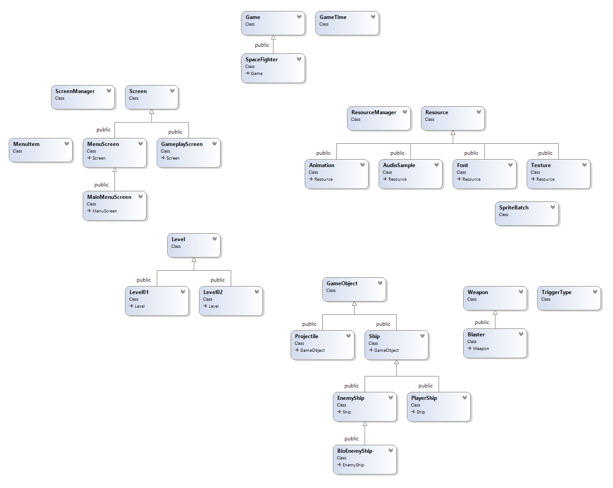

# Space Fighter

This is a game created for the students of Fox Valley Technical College.

## About the Project

The solution is broken into two projects:

| **Project**             | **Description** | **Namespace** |
| :---------------------: | :-------------- | :-------------: |
| **Katana Engine**       | A library of classes, interfaces, and typedefs that provide a foundation for developing 2d games in C++. | KatanaEngine |
| **Space Fighter**       | A sample "shmup" game to research and modify. | Global |

## Getting Started

To get started, fork this project to your account, then try running it.
If it doesn't work you may need to set the startup project and/or update the SDK, by following these steps:

### Change the startup project
If the game compiles but won't run (you get an error message), change the startup project:
- Right click on the SpaceFighter project and select "Set as StartUp Project"

### Update the SDK
If the game won't compile, update the sdk:
- Right click on a project (KatanaEngine or SpaceFighter, you'll have to do both), and click "Properties."
- Under the "General" Configuration Properties, change the Windows SDK Version to the latest installed version.
- Click "Apply" then "OK"
- Repeate these steps for the other project.

## Documentation

Full documentation for the project can be found [here](https://docs.shurikenstudios.com/katana-engine/).

## Class Diagram

> **Note:** The class diagram does not show all classes, only the most important ones, and the ones that are most likely to need modification.